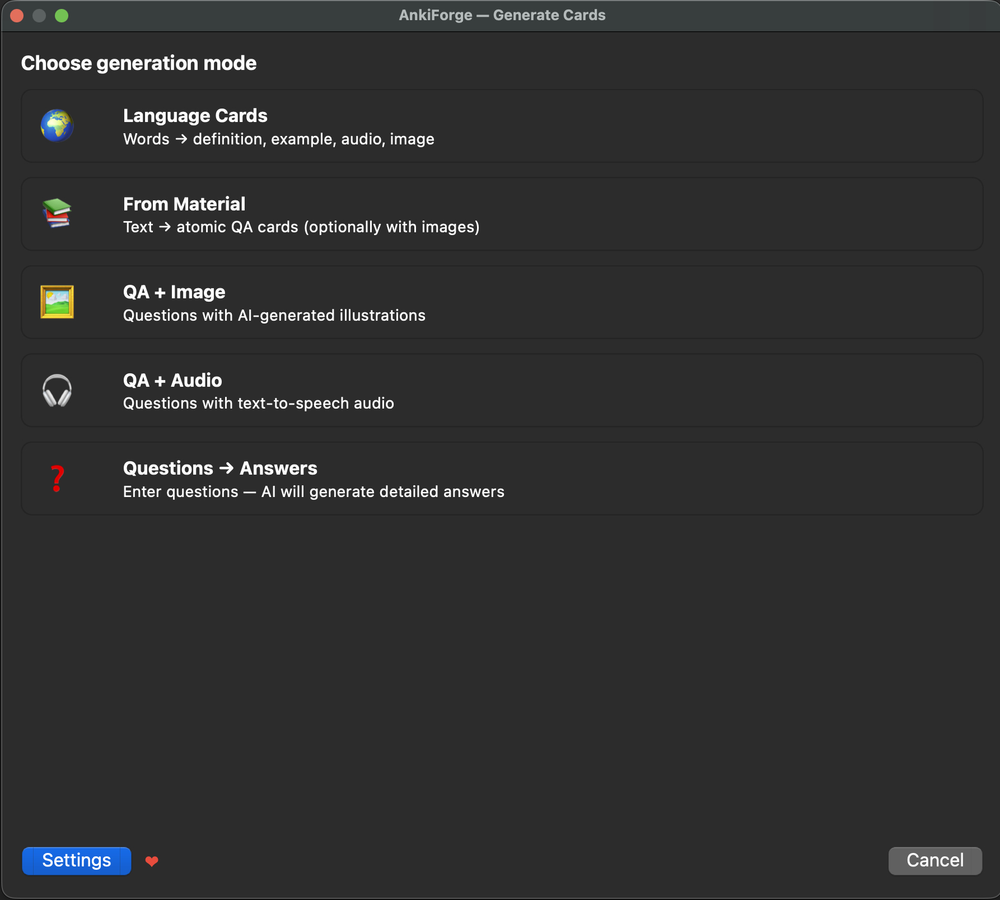
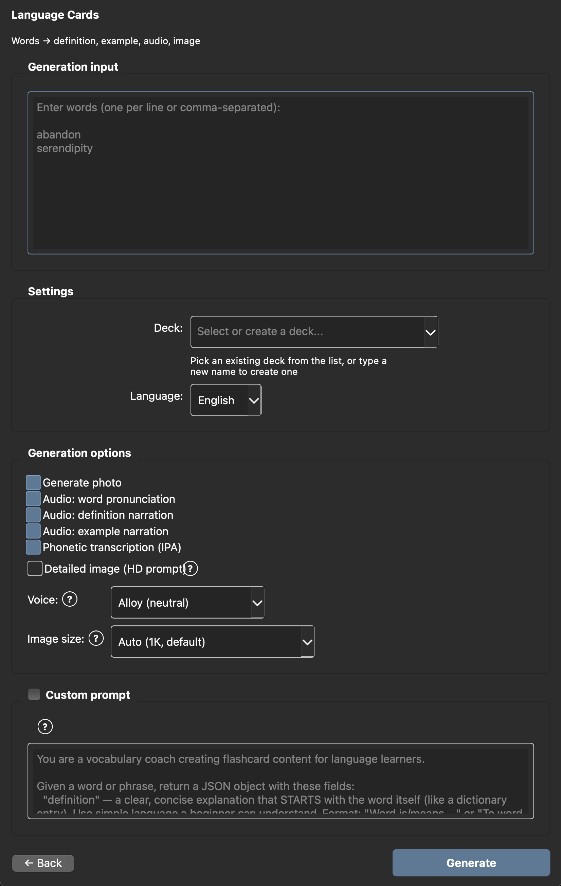
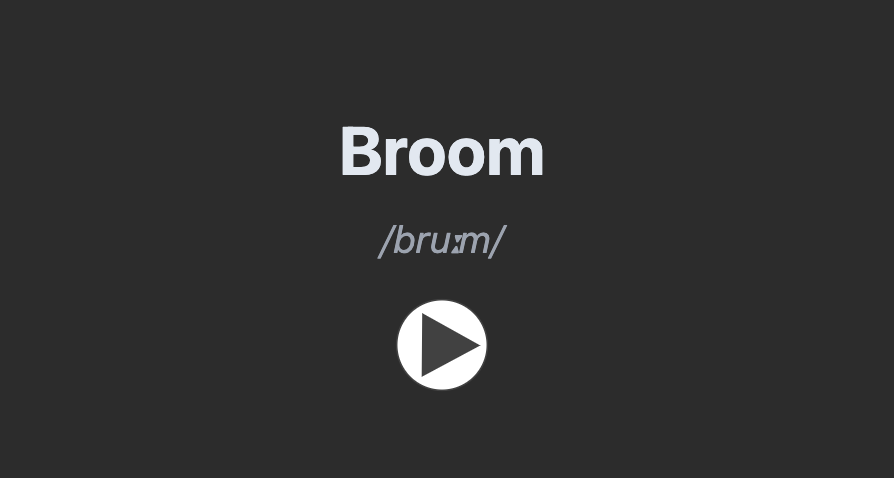
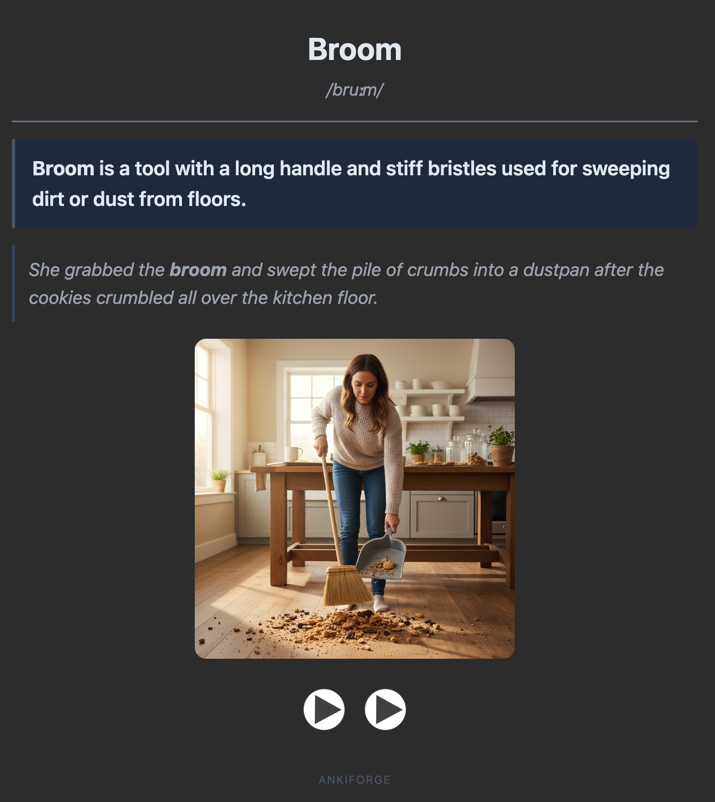
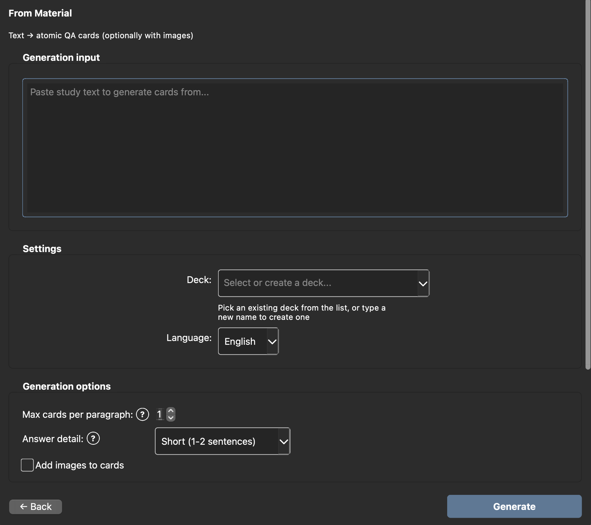
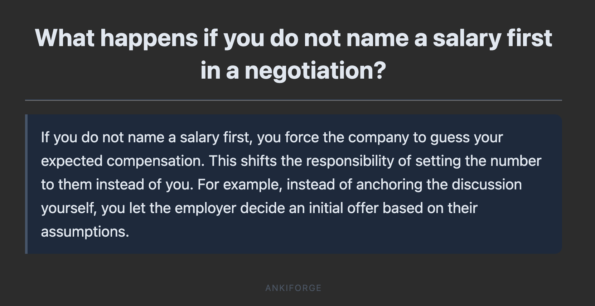
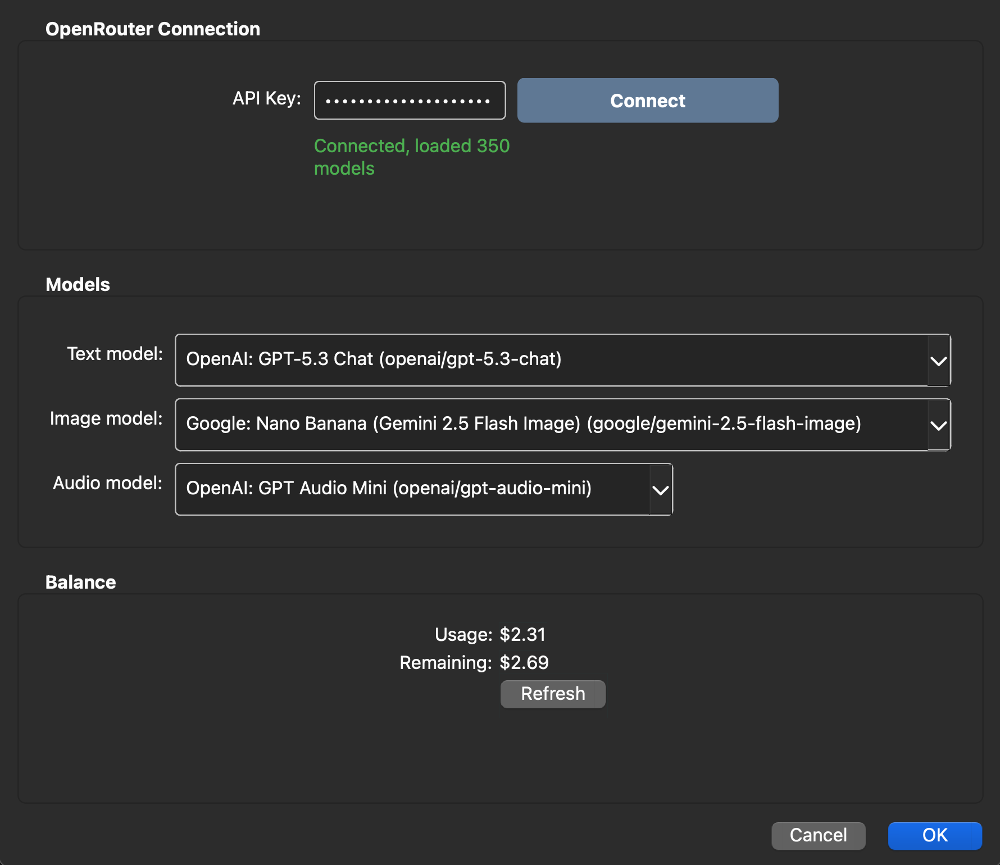

# AnkiForge NG

> Fork of [AnkiForge](https://github.com/Xpom1/AnkiForge) by Xpom1, licensed under GPL-3.0.
>
> This fork adds:
> - Support for local/custom OpenAI-compatible APIs (LM Studio, Ollama, vLLM, ...) alongside OpenRouter — mix and match models per slot (text/image/audio).
> - Free, fully offline **image generation** via a local Automatic1111 (stable-diffusion-webui) or ComfyUI server — pick a backend in Settings and select "Local Stable Diffusion" as the Image model.
> - A fix for a JSON-parsing bug where an unquoted IPA value could corrupt the generated definition/example fields.

**AI-powered flashcard generation for Anki** — create high-quality cards in seconds using any LLM via [OpenRouter](https://openrouter.ai/) or a local model server.

<!-- Replace with actual screenshot after taking them -->


---

## What is AnkiForge NG?

AnkiForge NG is a free, open-source Anki add-on that generates flashcards using AI. Instead of spending hours writing cards by hand, just type a few words or paste your study notes — AnkiForge NG creates complete, ready-to-study cards with definitions, examples, audio, and images.

It works with **any model** available on OpenRouter (GPT-4o, Claude, Gemini, Llama, and 200+ others) — or with a **local model server** like LM Studio, Ollama, or vLLM — so you choose the price/quality/privacy balance that works for you.

## Features

### 5 Generation Modes

| Mode | What you give it | What you get back |
|------|-----------------|-------------------|
| **Language Cards** | A list of words | Definition, example sentence, IPA transcription, audio pronunciation, and a photo for each word |
| **Questions → Answers** | Your questions | Detailed AI-generated answers as Q&A flashcards |
| **From Material** | Any study text (notes, articles, textbook pages) | 10–30 atomic Q&A cards extracted from key facts |
| **QA + Image** | Your questions | Answers with AI-generated illustrations |
| **QA + Audio** | Your questions | Answers with text-to-speech narration |

### Why AnkiForge NG?

- **Any LLM model** — pick from 200+ models on OpenRouter, from free to state-of-the-art
- **Local models too** — point any dropdown at LM Studio, Ollama, or another OpenAI-compatible server for free, private generation
- **Local image generation** — generate illustrations for free with a local Automatic1111 or ComfyUI server, no API cost per image
- **Cost estimation** — see the price before generating, track actual spending in real time
- **Custom prompts** — tweak AI instructions for any mode to fit your study style
- **Code highlighting** — cards render code blocks with syntax highlighting via highlight.js
- **Batch generation** — enter multiple words or questions at once
- **Progress tracking** — real-time progress bar with cancel support
- **Beautiful card templates** — styled HTML/CSS cards that look great in both light and dark mode

## Screenshots

### Mode Selection


### Language Cards — Input


### Language Card — Front & Back
| Front | Back |
|-------|------|
|  |  |

### From Material — Input


### Questions → Answers — Result


### Settings


## Installation

### From AnkiWeb (recommended)

1. Open Anki
2. Go to **Tools → Add-ons → Get Add-ons...**
3. Paste the add-on code: `597444116`
4. Restart Anki

### Manual install

1. Download the latest `.ankiaddon` file from [Releases](../../releases)
2. In Anki, go to **Tools → Add-ons**
3. Click **Install from file...** and select the downloaded file
4. Restart Anki

## Setup

### 1. Get an OpenRouter API Key

1. Create an account at [openrouter.ai](https://openrouter.ai/)
2. Go to [Keys](https://openrouter.ai/keys) and generate a new API key
3. Add credits (starting from $5 is enough for thousands of cards)

### 2. Configure AnkiForge

1. In Anki: **Tools → AnkiForge Settings**
2. Paste your API key
3. Pick models for text, image, and audio generation
4. Click **OK**

### 3. Generate your first cards

1. Click the **AnkiForge** button in the toolbar (or **Tools → AnkiForge**)
2. Choose a generation mode
3. Type words, questions, or paste study material
4. Pick a target deck (or type a new name to create one)
5. Click **Generate**

## Local Image Generation (optional)

Instead of paying per image through OpenRouter, you can point AnkiForge at a
local Stable Diffusion server for free, offline image generation. In
**Tools → AnkiForge Settings → Local Image Generation**, pick a backend, set
its URL, hit **Test connection**, then select **"Local Stable Diffusion"** as
the Image model.

Three backends are supported:

| Backend | What it is | Default URL |
|---------|-----------|--------------|
| **Automatic1111** | [stable-diffusion-webui](https://github.com/AUTOMATIC1111/stable-diffusion-webui) | `http://127.0.0.1:7860` |
| **Draw Things** | [Draw Things](https://drawthings.ai/) app (Mac/iOS), native Apple Silicon — enable its HTTP API server under Settings → API Server | `http://127.0.0.1:7860` |
| **ComfyUI** | [ComfyUI](https://github.com/comfyanonymous/ComfyUI) — requires a checkpoint filename in Settings, since ComfyUI has no "currently loaded model" concept | `http://127.0.0.1:8188` |

### Notes from getting this working in practice

- **On Apple Silicon, prefer Draw Things over ComfyUI.** We hit a
  reproducible "shattered glass" / noise-like image bug running ComfyUI on
  MPS (Apple GPU) with an SDXL-Turbo checkpoint — confirmed environmental
  (ComfyUI + MPS), not an AnkiForge bug, by generating a correct image from
  the same checkpoint in Draw Things. Draw Things is a native Apple Silicon
  app and doesn't have this issue.
- **Avoid "Turbo"/"Lightning"/LCM checkpoints if you see garbled or
  distorted output**, especially on multi-subject scenes. These are
  distilled for 1-4 step sampling and need very specific settings (an
  *ancestral* sampler, low CFG scale) to look right — AnkiForge auto-detects
  known markers in ComfyUI checkpoint filenames and adjusts steps/CFG/sampler
  accordingly, and defaults Draw Things to an ancestral sampler too, but a
  plain (non-distilled) checkpoint is simply more forgiving and reliable.
  **DreamShaper v8** (SD1.5, non-Turbo) has worked well for us as a general
  illustration model — clean style, stable anatomy, no license to bother with
  for personal use.
- **Resolution matters more than you'd expect.** Generating an SDXL-family
  checkpoint below its native resolution (~1024px) produces a tiled,
  fractured look rather than just "less detail" — set **Resolution** to
  `1024` in Settings for SDXL checkpoints (SDXL-Turbo specifically was
  distilled at 512px, so it's the one SDXL exception). AnkiForge auto-detects
  this from the ComfyUI checkpoint filename; for Automatic1111/Draw Things
  (no checkpoint info available) set it explicitly.
- **The "Advanced (JSON)" field** in Settings lets you override
  steps/cfg_scale/sampler_name/resolution directly, e.g.
  `{"steps": 25, "cfg_scale": 7, "sampler_name": "DPM++ 2M Karras"}` — useful
  for a checkpoint or sampler preference the auto-detection doesn't cover, or
  to just pin settings once instead of re-tuning them per request. Sampler
  names differ by backend: ComfyUI uses lowercase ids (`euler`,
  `euler_ancestral`, `dpmpp_2m`), Automatic1111/Draw Things use dropdown-style
  names (`Euler`, `Euler a`, `DPM++ 2M Karras`).
- **Managing disk space in Draw Things:** open the model picker → **Manage**
  → swipe/delete a downloaded model you no longer use. Downloaded checkpoints
  can be several GB each.

### Working example: Draw Things + DreamShaper v8

The setup that's worked reliably for us on Apple Silicon:

- Backend: **Draw Things**, URL `http://127.0.0.1:7860`, HTTP API server
  enabled in Draw Things (Settings → API Server → Protocol: HTTP)
- Model loaded in Draw Things: **DreamShaper v8** (not XL, not Turbo)
- Resolution: `512` (DreamShaper v8 is SD1.5-native)
- Advanced (JSON):
  ```json
  {"steps": 16, "cfg_scale": 7, "sampler_name": "DPM++ 2M AYS"}
  ```
  (`DPM++ 2M AYS` is Draw Things' default sampler — matching it here avoids
  a mismatch between what AnkiForge requests and what the app actually uses.)

## Pricing

AnkiForge is **free**. You only pay for AI usage through OpenRouter.

| Mode | Cost per card* |
|------|---------------|
| Questions → Answers | ~$0.001 |
| Language (text only) | ~$0.002 |
| Language (text + audio + image) | ~$0.01 |
| From Material | ~$0.001 per card |
| QA + Image | ~$0.01 |
| QA + Audio | ~$0.003 |

\* *Estimates for GPT-4o-mini. Actual cost depends on the model you choose. AnkiForge shows the estimated cost before generation.*

## Requirements

- **Anki** 23.10+ (Qt6)
- **OpenRouter** account with API key
- Internet connection

## Development

```bash
git clone https://github.com/sdelfi/AnkiForge-NG.git
cd AnkiForge-NG

uv sync                          # install dependencies
uv run pytest                    # run tests with coverage
uv run ruff check src/ tests/    # lint
uv run ruff format src/ tests/   # format
uv run mypy src/                 # type check
```

### Releasing

Bump `__version__` in `src/ankiforge/__init__.py` and push to `main` —
[.github/workflows/release.yml](.github/workflows/release.yml) builds the
`.ankiaddon` and publishes it as a GitHub Release tagged `vX.Y.Z`. Ordinary
commits are a no-op for this (the workflow skips creating a release if that
version's tag already exists), so nothing extra needs pushing when the
version hasn't changed. AnkiWeb has no upload API, so the new build still
needs to be uploaded there by hand at https://ankiweb.net/shared/addons/
("Share Add-on" → add a branch with the new version).

## Project Structure

```
src/ankiforge/
├── __init__.py               # Entry point — registers add-on in Anki
├── models.py                 # Dataclasses: CardRequest, GeneratedCard, AddonConfig
├── config/
│   ├── manager.py            # Read/write config via Anki API + JSON fallback
│   └── dialog.py             # Settings dialog (API key, model pickers, balance, local endpoint)
├── openrouter/
│   ├── client.py             # HTTP client with retry/backoff (OpenRouter + any OpenAI-compatible server)
│   ├── routing_client.py     # Routes calls to OpenRouter vs. a local/custom endpoint by model id
│   ├── models.py             # Model, Modality types
│   └── exceptions.py         # Typed exception hierarchy
├── generators/
│   ├── language.py           # Word → definition + example + audio + image
│   ├── questions.py          # Question → detailed answer
│   ├── material.py           # Text → atomic QA cards (2-phase map-reduce)
│   ├── image.py              # Question → answer + AI illustration
│   └── audio.py              # Question → answer + TTS audio
├── anki_bridge/
│   ├── deck_manager.py       # Deck CRUD
│   ├── media_manager.py      # Save audio/images to Anki media folder
│   └── note_types.py         # 4 note types with HTML/CSS templates
└── ui/
    ├── main_button.py        # Toolbar & deck browser button
    ├── generate_dialog.py    # Mode selection, input dialog, generation logic
    ├── progress_widget.py    # Progress bar with cancel
    └── styles.py             # Shared QSS styles
```

## Support the Project

AnkiForge NG is free and open source. If you find it useful, consider supporting development of this fork:

**EVM:** `0xb67934785132FD5b4DEcEaF70780F5E8bA48580f`
<br>Networks: Ethereum, Base, Arbitrum, Avalanche

This fork builds on the original [AnkiForge](https://github.com/Xpom1/AnkiForge) by Xpom1.

## License

GPL-3.0 — see [LICENSE](LICENSE). This is a fork of [AnkiForge](https://github.com/Xpom1/AnkiForge) by Xpom1, also GPL-3.0.
